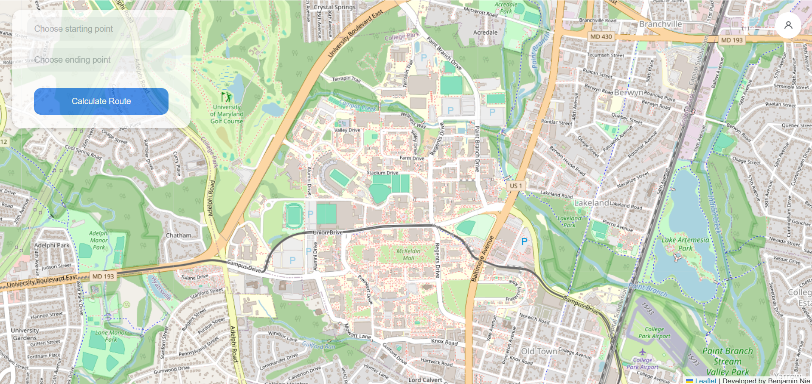
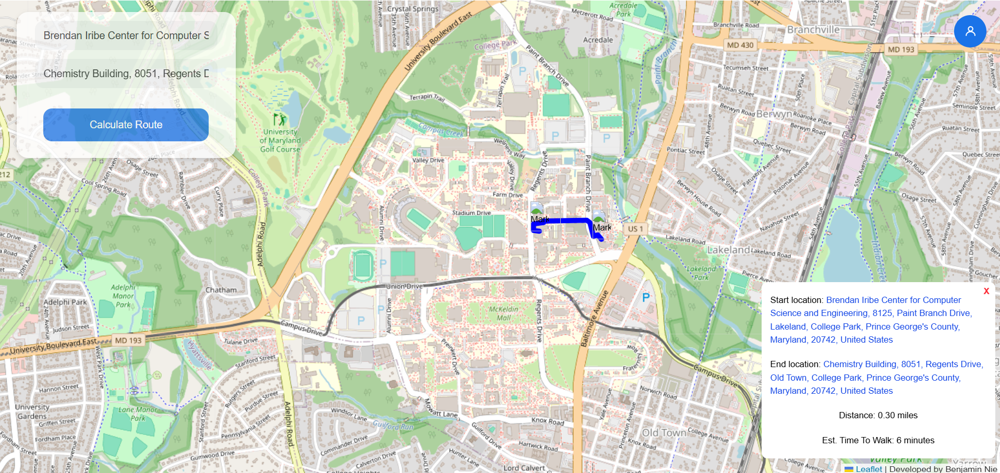
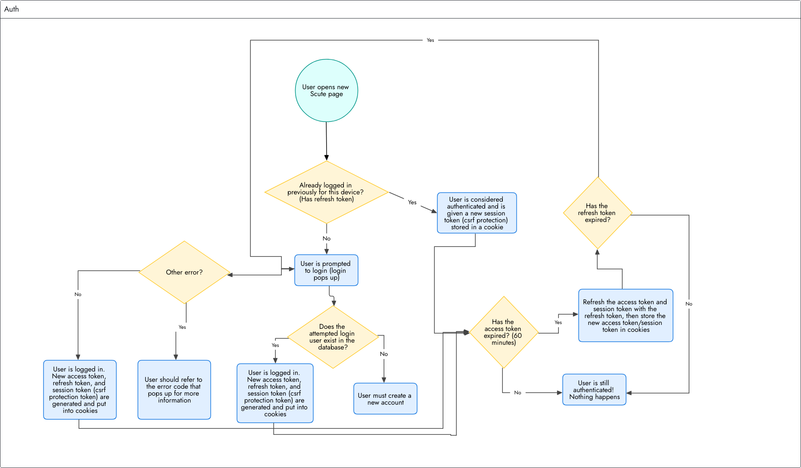
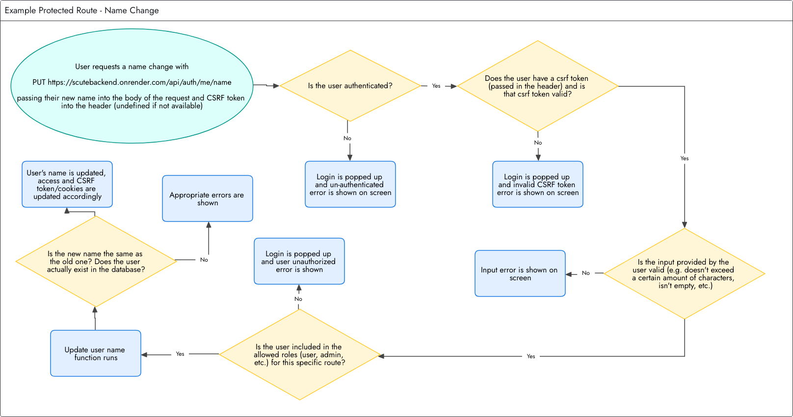

## Scute

An interactive map routing application localized to the University of Maryland protected through auth. Custom user auth includes: account creation, login, logout, reset password, account deletion, profile management.

https://scute.onrender.com

(Please note that this service may take up to a minute or two to start up)

## Table of Contents
* [Quick start](#quick-start)
* [Usage](#usage)
* [Auth](#auth)
* [Project Structure](#project-structure)
* [Tech Stack](#tech-stack)
* [Contributing](#contributing)
* [License](#license)

## Quick start

### 1. Clone the repository:
```
git clone https://github.com/Neb465/scute.git
cd scute
```
### 2. Install dependencies
```
# Frontend
cd frontend
npm install

# Backend
cd ../backend
npm install

# Pathfinding
cd ../pathfinding-service
pip install -r requirements.txt
```
### 3. Configure environment variables
Create a ```.env``` file in the ```backend``` directory
```
PORT=your_expressjs_port

# Database
DB_USER=your_postgres_username
DB_HOST=your_postgres_host
DB_NAME=your_postgres_name
DB_PORT=your_postgres_port
DB_PASSWORD=your_postgres_password

# JWT
JWT_ACCESS_TOKEN_SECRET=random_string_of_characters
JWT_REFRESH_TOKEN_SECRET=random_string_of_characters
JWT_ACCESS_EXPIRATION=your_access_token_expiration_time
JWT_REFRESH_EXPIRATION=your_refresh_token_expiration_time

# Cross-site request forgery
CSRFCSRF_SECRET=random_string_of_characters

# Email API
GOOGLE_API_CLIENTID=your_googleapi_clientid
GOOGLE_API_CLIENTSECRET=your_googleapi_clientsecret
GOOGLE_API_REFRESH=your_googleapi_refresh_token

# URLs
ASTAR_URL=your_pathfinding_service_url
FRONTEND_URL=your_frontend_url
```
Create a ```.env``` file in the ```frontend``` directory
```
# URL
VITE_API_BASE_URL=your_backend_url
```
### 4. Start the development servers
**You will have to open three separate terminals
```
cd frontend
npm run dev

cd backend
npm run dev

cd pathfinding-service
python app.py
```
### 5. Running the program
Navigate to ```http://localhost:5173``` (or the port shown in your terminal running the frontend development server)

## Usage
### 1. Generating Routes
   **You must be authenticated to generate routes. If you aren't, then log in**
   - Click on the "Choose starting point" input, and enter your desired starting location (results should auto-fill)
   - Click on the "Choose ending point" input, and enter your desired ending location (results should auto-fill)
   - Click on the "Calculate Route" button to generate the route



### 2. Interpreting the route
   - Each route is defined by two markers, indicating the start and end points, and a solid blue line, indicating the route itself
   - A popup will appear in the bottom right corner of the screen, showing information about the route



## Auth
Primarily utilizes: **JSON Web Tokens** stored in cookies for ```access```, ```refreshing``` (though refresh tokens are also stored in the database for instant revocation of all refresh tokens for a certain user across different sessions), and ```cross-site request forgery``` (CSRF). Passwords are hashed using **bcrypt**, and every piece of sensitive information is hashed before being stored in the database. 

***Relevant packages: bcrypt, cookie-parser, cors, csrf-csrf, express-rate-limit, helmet, joi, jose***

Attached is a very simple overview of the authentication system and an example of a protected route.




## Project Structure
```
scute/
├── backend/
│ ├── server.js               # Express app entry
│ └── src/
│   ├── controllers/          # Auth + pathfinding handlers
│   ├── middleware/           # Auth, CSRF, validation middleware
│   ├── models/               # Database access layer
│   └── routes/               # API route definitions
├── frontend/
│ └── src/
│   ├── api/                  # HTTP client calls (auth, route, fallback refresh)
│   ├── components/           # UI components
│   ├── hooks/                # React query/state hooks
│   ├── pages/                # Top-level page views
│   └── stores/               # Client-side state stores
├── pathfinding-service/
│ ├── app.py                  # Flask API entry
│ └── astar.py                # A* route calculation logic
└── README.md                 # Project overview/setup
```

## Tech Stack
Frontend: React, Vite, TailwindCSS

Backend: ExpressJS

Database: Supabase (PostgreSQL locally)

Pathfinding: Python (for algorithm implementation), Flask

## Contributing
Any contributions (pull requests) would be greatly appreciated! 

## License
MIT License -- see [LICENSE](./LICENSE)
